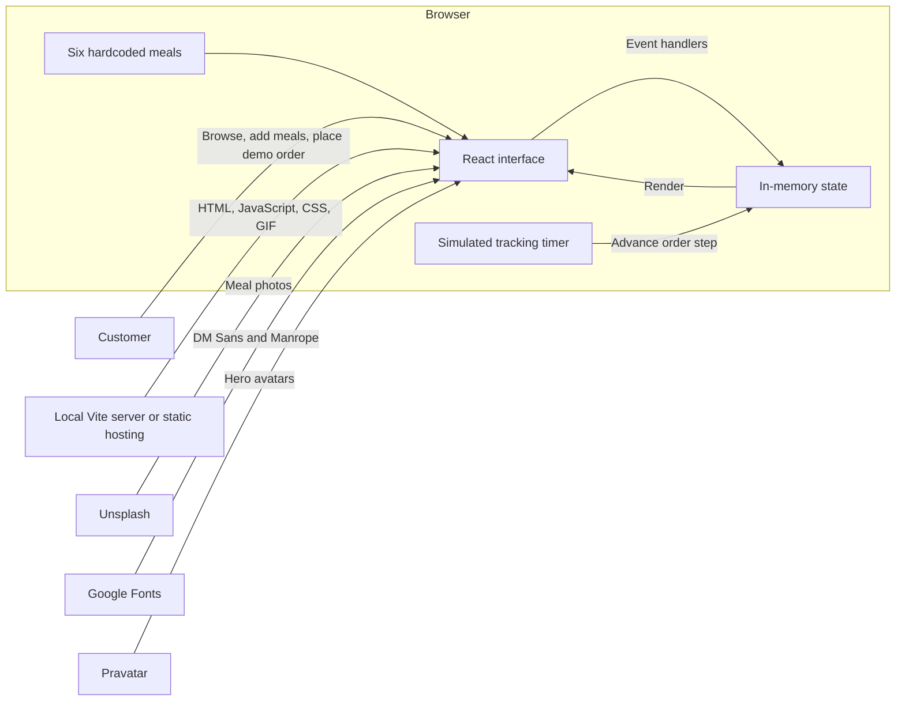
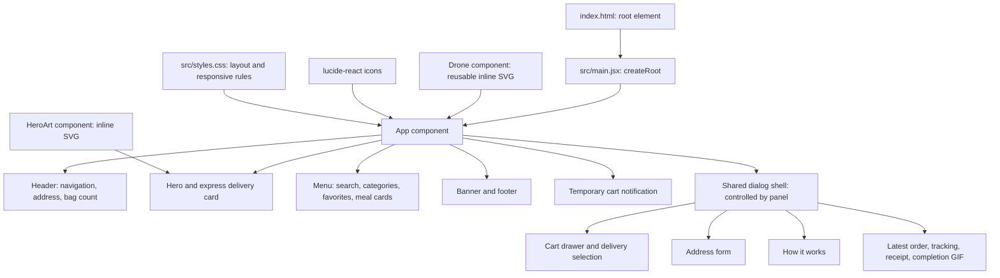
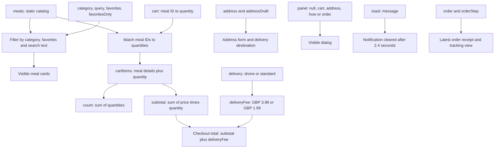
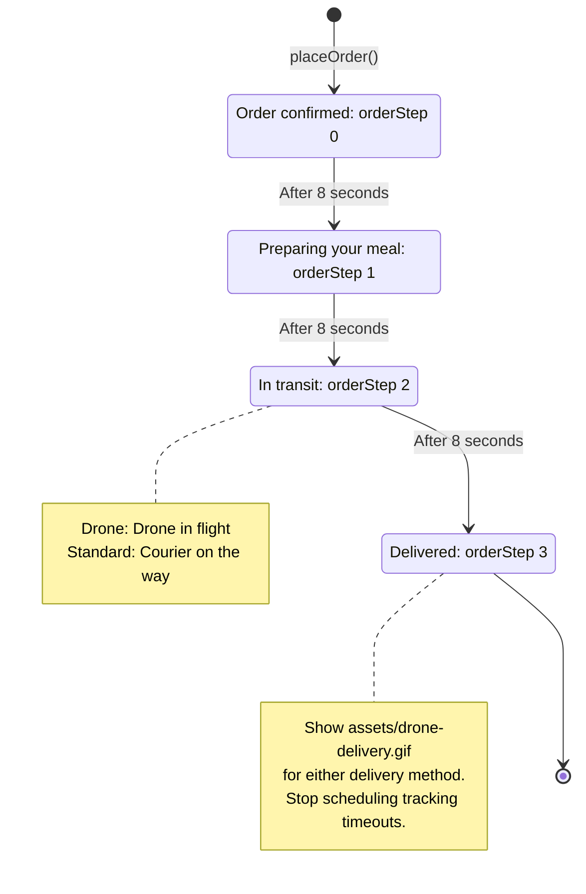
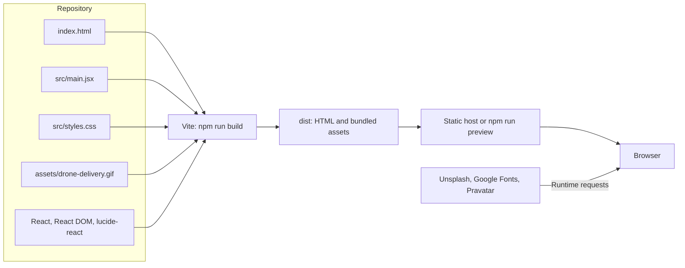

# Airbite

A simple React food delivery demo with express drone delivery. This document describes the current implementation; the diagrams use Mermaid.

## Run and build

```sh
npm install
npm run dev
```

Open the local URL printed by Vite (usually http://localhost:5173).

```sh
npm run build
npm run preview
```

## 1. System overview

Everything involved in browsing, checkout, and tracking runs in the browser. External services supply visual assets only.



There is no backend, database, authentication, payment processing, geocoding, or real drone integration. Delivery availability, ratings, and delivery estimates are demo content.

## 2. Code and interface structure

`App` owns all state and behavior. The interface regions below are inline JSX inside `App`; only `Drone` and `HeroArt` are separate helper components. Navigation scrolls the page or opens a dialog, without a router.



The shared dialog shell handles Escape, focus trapping and restoration, backdrop dismissal, and body scroll locking. CSS adapts the menu grid, header, hero, and dialogs for smaller screens.

## 3. State and derived data

React `useState` holds session data. Filtered meals, cart contents, quantities, and prices are recalculated during rendering rather than stored separately.



Cart quantities never go below zero; zero-quantity entries are removed. Search is case-insensitive across meal name, restaurant, category, and description. Prices display in GBP through `Intl.NumberFormat`.

## 4. Checkout sequence

`placeOrder()` snapshots the selected meals, total, delivery method, and address. Subsequent edits to the cart or address do not change that receipt.

```mermaid
sequenceDiagram
    actor Customer
    participant App as React App
    participant State as In-memory state
    participant Timer as Browser timer

    Customer->>App: Add a meal or change quantity
    App->>State: updateCart(mealId, change)
    App-->>Customer: Render bag count and calculated totals
    Customer->>App: Open bag and select delivery
    App->>State: Set delivery to drone or standard
    App-->>Customer: Render updated fee and total
    Customer->>App: Place demo order
    alt Bag is empty
        App-->>Customer: Keep empty bag view; no order created
    else Bag contains meals
        App->>State: Save order snapshot with an AB-prefixed number
        App->>State: Clear cart, set orderStep to 0, open order dialog
        App-->>Customer: Show order confirmed and receipt
        loop Until orderStep reaches 3
            App->>Timer: Schedule an 8-second timeout
            Timer->>State: Increment orderStep
            State-->>App: Re-render tracking
        end
        App-->>Customer: Show Delivered and drone-delivery.gif
    end
```

Only the latest order is retained. A new order replaces it and restarts tracking. Order numbers use the last five digits of `Date.now()` and are demo identifiers, not guaranteed unique IDs.

## 5. Delivery lifecycle

Both delivery methods use the same simulated timer. The selected method changes the fee, displayed estimate, icon, and transit label.



The demo completes in approximately 24 seconds; the advertised 10–20 minute drone and 30–45 minute standard estimates do not drive the timer. Closing the dialog leaves tracking running, so **My orders** can reopen the current status. Refreshing the page resets all state, including the latest order.

## 6. Build and asset delivery

Vite bundles the application for static hosting. The completion GIF is imported from the repository and emitted with a hashed filename; it requires no external image service.



The local completion animation ships with the app. Meal photos, fonts, and avatars require internet access. All application logic remains in [src/main.jsx](src/main.jsx), with presentation in [src/styles.css](src/styles.css); [package.json](package.json) defines the development and build commands.
